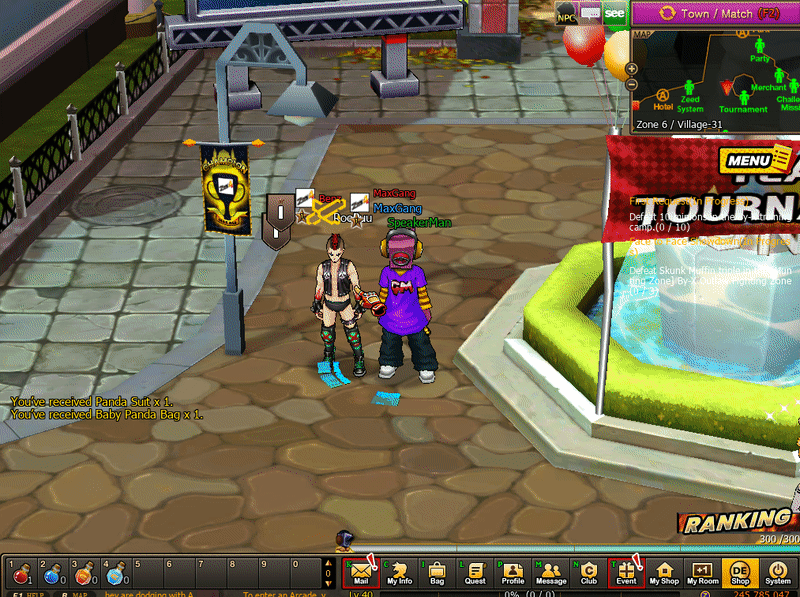
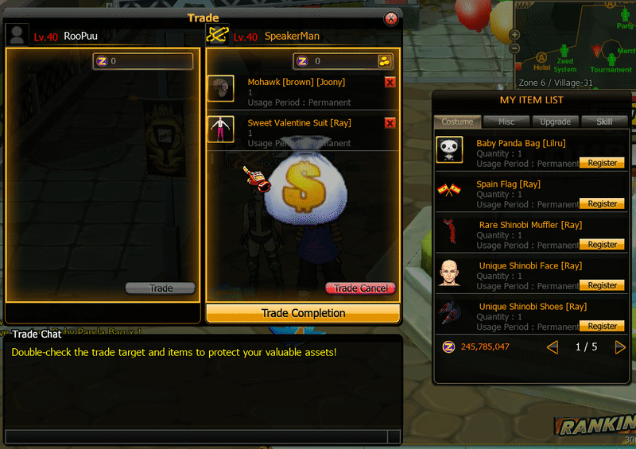
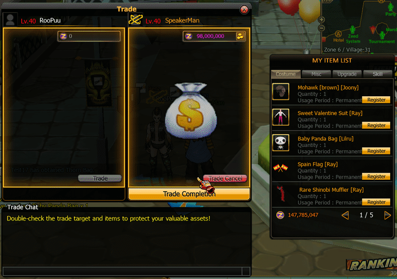

# 💱 Exchange System

The **P2P Exchange System** allows two players to directly trade items and in-game currency (Z) with each other within the game.

<figure><figcaption></figcaption></figure>

## Trade UI Components

#### Trade Window <a href="#trade-window" id="trade-window"></a>

| Component           |
| ------------------- |
| Player Info         |
| ZEN                 |
| Item Slot           |
| Trade Button        |
| Trade Cancel Button |

### Item Trading

<figure><figcaption></figcaption></figure>

Players can register items from:

```
MY ITEM LIST (MAXIMUM 5 PIECES)
```

to

```
Trade Slot
```

<figure><figcaption></figcaption></figure>

***

### Zen Trading

<figure><figcaption></figcaption></figure>

Players can enter the amount of Zen.

```
(Z)MY Zen (MAXIMUM 98,000,000)
```

to

```
(Z) Zen Slot
```

<figure><figcaption></figcaption></figure>
