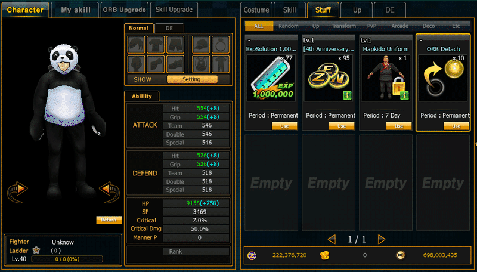

# ORB Detach

### Overview

The **ORB Detach System** allows players to remove ORBs from Costumes or Equipment without losing them.

To do so, players must use a special item.

<figure><figcaption></figcaption></figure>

### Usage Rule

```
1 ORB Detach = Remove 1 ORB
```

**Example:**

| ORB   | Required Item |
| ----- | ------------- |
| 1 Orb | 1 Item        |

## ORB Detach Flow



ผู้เล่นเปิด My Room .png>)

```
My Room
```

<figure><figcaption></figcaption></figure>


Use Item > ORB Detach > Costume Registration

```
ORB Detach Item
```



### Step 2

<figure><figcaption></figcaption></figure>

Confirm Costume Item ที่ต้องการใช้งาน

```
Unsocket ORB
```



***

#### Result

<figure><figcaption></figcaption></figure>

<figure><figcaption></figcaption></figure>

```
ORB → Inventory
Item Slot → Empty
```
