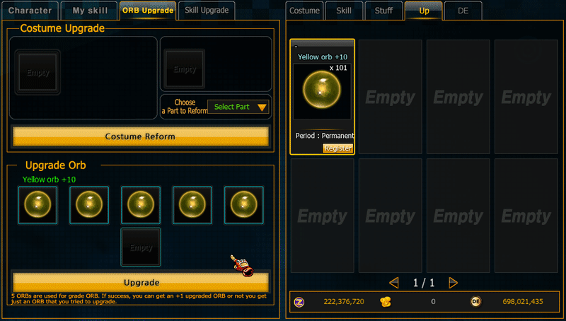

# ORB Upgrade

## Overview <a href="#orb-upgrade-system" id="orb-upgrade-system"></a>

<figure><figcaption></figcaption></figure>

Based on the image, the Upgrade system is used to create higher-level ORBs.

```
5 ORBs
```

***

#### Upgrade Rule <a href="#upgrade-rule" id="upgrade-rule"></a>

```
5 ORB → 1 ORB (+1 Level)
```

<figure><figcaption></figcaption></figure>

| Result  | Description |
| ------- | ----------- |
| Success | ORB Level+1 |

***

```
5 ORB → 1 ORB (+0 Level)
```

<figure><figcaption></figcaption></figure>

```
```

| Result | Description                                        |
| ------ | -------------------------------------------------- |
| Fail   | ORB Level remains the same (consumes 4 materials). |
