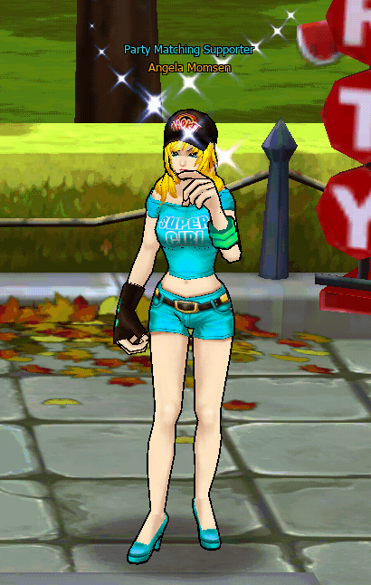
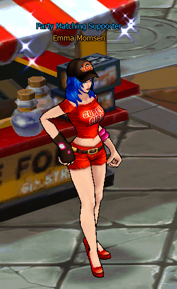
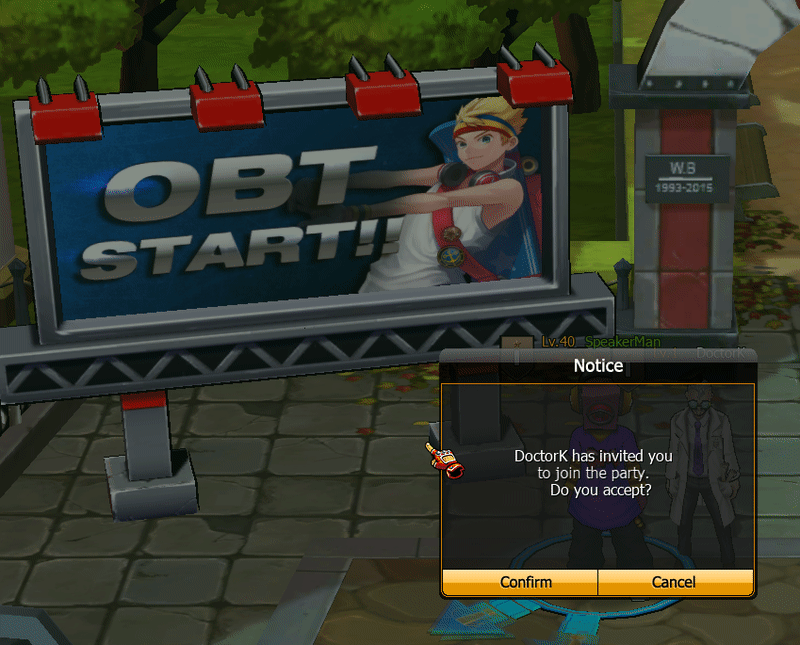

# 👯 Party System

## **Overview**

The Party System in Zone4 is designed to allow players to team up and fight together in PvE modes and various in-game activities, such as:

* Hunting Ground
* Arcade Mode
* Mission Dungeon
* Event Content

The Party System enables **cooperative combat**, allowing players to improve battle efficiency, level up faster, and clear more challenging stages.

To create a party, players must interact with a specific NPC located in the main town (Zone6), which serves as a lobby for forming teams before entering combat.

***

### **NPC List**

#### 1️⃣ **Angela Mamson ⭐**

<figure><figcaption></figcaption></figure>

#### 2️⃣ **Emma Mamson**

<figure><figcaption></figcaption></figure>

#### 3️⃣ **Mery Mamson**

<figure><figcaption></figcaption></figure>

All three NPCs have the same functions:

* Create a Party
* Join a Party
* Search for available Parties

Players can interact with any of these NPCs to manage their Party.

***

### **How to create Party from NPC**



**Step 1 – Go to Village (Zone 6)**




**Step 2 – Talk to NPC Party**

Choose any NPC, such as:

* Angela Mamson
* Emma Mamson
* Mery Mamson

<figure><figcaption></figcaption></figure>

The NPC will open the Party System window.



**Step 3 – Select Form Party**

<figure><figcaption></figcaption></figure>

The NPC will open the Party System window.

Players will be able to:

* Set a Party name
* Choose the Party type, such as:
  * **Public Party** (will be listed in Party Matching)
  * **Private Party** (will not be listed in Party Matching)



**Step 4 – Setting Party**

<figure><figcaption></figcaption></figure>

The NPC will open the Party System window.

The Party creator can set:

* **Party Name**
* **Party Type**

Once confirmed, the player will become the **Party Leader**.



**Step 5 – Confirm and Create Party**

Once confirmed, the player will become the **Party Leader.**

<figure><figcaption></figcaption></figure>

<figure><figcaption></figcaption></figure>



### **How to create Party from User**



**Step 1 –** Right-Click On your Character

<figure><figcaption></figcaption></figure>

Select Form Party



**Step 2 – Setting Party**

<figure><figcaption></figcaption></figure>



**Step 3 – Confirm and Create Party**

After confirming, the player will become the **Party Leader.**

<figure><figcaption></figcaption></figure>

<figure><figcaption></figcaption></figure>



**Joining a Party**

Players can join a Party in two ways:

**1. Join Party via NPC**\
Interact with a Party NPC and select → **Join Party**

<figure><figcaption></figcaption></figure>

<figure><figcaption></figcaption></figure>

<figure><figcaption></figcaption></figure>

The system will display:

* A list of available Parties
* Number of members
* Party Leader

Players can select the Party they want to join.

**2. Invitation from the Leader**

<figure><figcaption></figcaption></figure>

The Party Leader can send a Party invitation.

<figure><figcaption></figcaption></figure>

Once you press Confirm, you will immediately join the team.

***

### **Leader Control**

The Leader has the authority to :

* Kick member
* Disband party
* Start mission

***

### **Item Distribution System**

<figure><figcaption></figcaption></figure>

> The Party Item Distribution System determines how loot dropped from monsters or missions is allocated among party members.\
> Party leaders can configure the distribution method before starting cooperative activities.

The system supports three distribution modes:

**Individual Distribution**\
Each player receives their own item drops independently, preventing competition over loot and ensuring fair distribution.

**In Order Distribution**\
Items are distributed sequentially among party members in a rotating order, guaranteeing equal opportunity for all players.

**Random Distribution**\
Loot is randomly assigned to a party member each time an item drops, adding an element of chance to item allocation.
