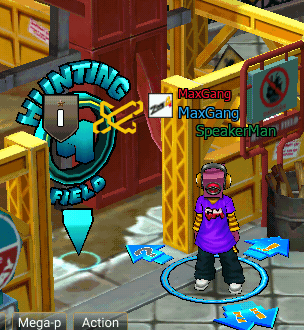
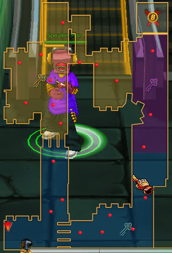
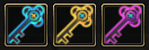
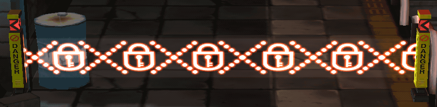
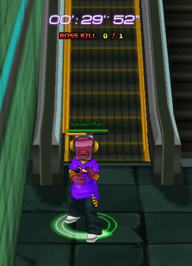

# Hunting Arcade

### Overview

**Hunting Arcade** is a PvE mode in Zone4 where players fight against AI-controlled enemies in an area called the **Hunting Land**.

The purpose of this mode is to:

* Farm EXP
* Farm items
* Practice combat
* Progress through the story

<figure><figcaption></figcaption></figure>

<figure><figcaption></figcaption></figure>

**Hunting Land**

When players enter the Hunting Land, they can choose a combat area.

**Example areas:**

| Area                 | Minimum Level |
| -------------------- | ------------- |
| BY-X Training Ground | Lv1           |
| BY-X Center          | Lv10          |
| Outlaw Fighting Zone | Lv15          |
| BY-X Safe House      | Lv20          |
| Mon-Exit Station     | Lv25          |

Each area has:

* A minimum level requirement
* Different enemy difficulty
* Different rewards

***

## Hunting Arcade Gameplay Mechanics

<figure><figcaption></figcaption></figure>

## Play-time System

The **Play Time System** is a mechanic used to control the duration of gameplay in the Hunting Arcade mode.

When players enter Hunting Arcade, the system starts tracking a session (run), which has a maximum duration of **30 minutes**.

During this time, players must:

* Fight enemies
* Clear the area
* Defeat the map’s boss

***

## Play Session Structure

A Hunting Arcade run is structured as follows:

```
Enter Hunting Arcade
        ↓
Timer Start (30:00)
        ↓
Fight Enemies
        ↓
Boss Spawn
        ↓
Kill Boss (1/1)
        ↓
Exit Instance
```

Players will be removed from Hunting Arcade when any of the following conditions are met:

***

### Time Limit Condition

**Condition 1: Time Expired**\
When players enter Hunting Arcade, a countdown timer will begin.

```
30:00 → 00:00
```

When the timer reaches **00:00**, the system will:

* End the session
* Remove the player from the instance
* Return the player to town

#### Key Collection Objective

<figure><figcaption></figcaption></figure>

<figure><figcaption></figcaption></figure>

```
Key Collected : 0 / 3
```

Players must:

* Defeat monsters
* Collect key drops
* Gather a total of 3 keys

Once all keys are collected:

<figure><figcaption></figcaption></figure>

```
Key Collected : 3 / 3
```

The Boss Gate can be unlocked (requires 3 keys).

***

#### Boss Kill Condition <a href="#id-2.2-boss-kill-condition" id="id-2.2-boss-kill-condition"></a>

<figure><figcaption></figcaption></figure>

**Condition 2: Boss Defeated**\
When the boss is defeated, a message will be displayed in the in-game UI.

```
BOSS KILL 0 / 1
```

<figure><figcaption></figcaption></figure>

This means:

* The map contains **1 Boss**
* Players must successfully defeat the Boss

Once players succeed:

```
BOSS KILL 1 / 1
```

The system will:

* Mark the mission as completed
* End the session immediately
* Remove the player from Hunting Arcade

Even if there is remaining time left.

***

### Session End Conditions Summary <a href="#id-3.-session-end-conditions" id="id-3.-session-end-conditions"></a>

| Condition       | Result                    |
| --------------- | ------------------------- |
| Time = 0        | Forced Exit               |
| Boss Kill = 1/1 | Mission Clear Forced Exit |
