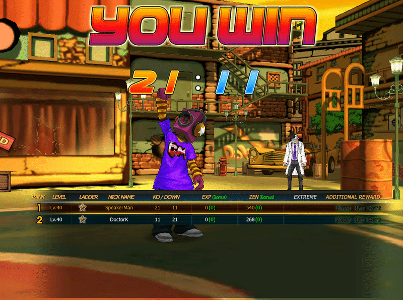

# Team Death Match

## Team Death Match

### Overview

**Team Death Match** is a mode where players are divided into two teams.

<div data-with-frame="true"><figure><figcaption></figcaption></figure></div>

```
Red Team
Blue Team
```

Each team can have up to **4 players**,\
so the maximum number of players in a room is **8**.

```
8 Players (4 vs 4)
```

The minimum requirement to start a match is:

```
1 vs 1
```

***

## Match Duration

The Room Host can select the match duration.

| Match Time | Description    |
| ---------- | -------------- |
| 3 Minutes  | Short Match    |
| 5 Minutes  | Standard Match |

When the time

```
Timer = 0
```

ช่วยแปลเป็นภาษาอังกฤษเพื่อ สื่อสารกับผู้เล่น

***

## Scoring System

The team’s score increases when defeating opposing players.

```
Enemy Kill = +1 Team Point
```

Example Scoreboard

<div data-with-frame="true"><figure><figcaption></figcaption></figure></div>

| Team      | Score |
| --------- | ----- |
| Red Team  | 21    |
| Blue Team | 11    |


The team with the highest score when time runs out will be the winner.


***

## Tie-Break Rule

**In case of a tie:**\
**Example:**

```
Red Team = 35
Blue Team = 35
```

The system will use the **MVP Player** as the tiebreaker.

**Rules:**

<pre><code>The team that has the <a data-footnote-ref href="#user-content-fn-1">MVP player</a> → that team wins.
</code></pre>

**Example:**

| MVP Player | Team     |
| ---------- | -------- |
| Player A   | Red Team |

**Summary:**

```
Red Team Win
```

***

## MVP System

### Overview

**MVP (Most Valuable Player)** is a system used to evaluate the best-performing player in a match.

MVP is not determined by kills alone, but is calculated based on multiple factors.

***

### MVP Calculation Factors

The factors used to calculate MVP are:

| Factor       |
| ------------ |
| Damage Dealt |
| Kill Count   |

The system will calculate a **Performance Score**, and the player with the highest score will be awarded **MVP**.

***

## Gameplay Impact of MVP

**MVP Roles**

The MVP system plays an important role in the game:

**1. Tie-break Decision**\
Used to determine the winner in case of a tie

**2. Player Recognition**\
Highlights the best-performing player in the match

**3. Performance Rewards**\
Some systems may grant:

* EXP bonus
* Zen bonus

[^1]: 
