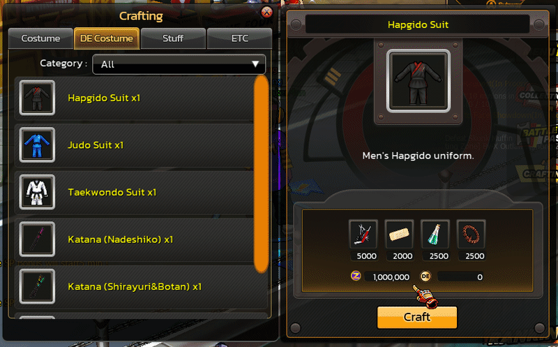

# 🔨 Craft System

## Overview

The **Craft System** is an **Item Crafting System** that allows players to combine **materials** and in-game currency to create new **Costumes** or **Equipment**.

This system enhances:

* **Item Progression**
* **Resource Sink**
* **Player Customization**

and serves as one of the core mechanics of the game’s item economy.

***

## Crafting Categories

<figure><figcaption></figcaption></figure>

The Craft System is divided into item categories.

<figure><figcaption></figcaption></figure>

| Category   |
| ---------- |
| Costume    |
| DE Costume |
| Stuff      |
| ETC        |

Players can select a category and view the list of items that can be crafted.

***

## Crafting Process



### Step 1: Player Selects Item

<figure><figcaption></figcaption></figure>

**Example:**\
Hapkido Suit

The system will load the recipe data for that item.



### Step 2: System Loads Recipe Data

The system retrieves recipe data from the database, such as:

<figure><figcaption></figcaption></figure>

* Required Materials
* Required Currency
* Success Rate
* Destroy Rate



***

## Success & Failure System

Crafting in Zone4 uses a **probability-based crafting system**.

<figure><figcaption></figcaption></figure>

**Example:**

| Result  | Rate |
| ------- | ---- |
| Success | 90%  |
| Destroy | 10%  |

If crafting fails, some or all materials will be destroyed.

***

## Blessing System

Players are required to use special items to assist in the crafting process.

```
Zeed Blessing
```

***

## Item Creation Output

When crafting is successful:

<figure><figcaption></figcaption></figure>

Players will receive the item, such as:

* **Hapkido Suit**

The item will be added to the player’s Inventory immediately.
