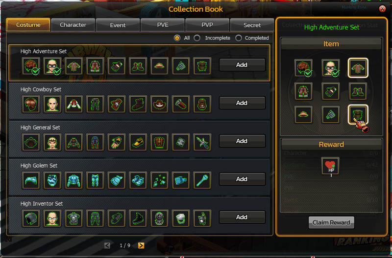
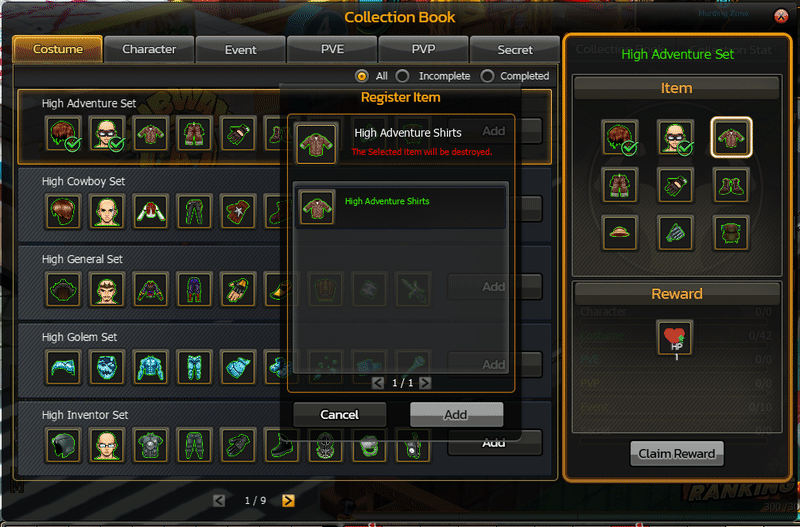

# 📚 Collection System

## Overview 

The **Collection System** is an **Item Collection System** that allows players to register in-game items into a **Collection Book** to unlock **Collection Achievements** and **Stat Rewards**.

The purpose of this system is to:

* Enhance **long-term progression**
* Encourage **item collection**
* Create an **item sink** to reduce excess items in the game economy
* Provide additional **character stat bonuses**

<figure><figcaption></figcaption></figure>

***

### Collection Category 

The **Collection Book** is divided into multiple collection categories.

| Category  |
| --------- |
| Character |
| PVE       |
| PVP       |
| Event     |
| Secret    |

Players can track their collection progress through the **Collection Achievement Panel**

## Collection Registration

Players can register items in the Collection Book by:

<figure><figcaption></figcaption></figure>

Select a **Collection Set:**

<figure><figcaption></figcaption></figure>

Select the item you want to register

<figure><figcaption></figcaption></figure>

Confirm the **Registration**


Registered items will **Destroyed**


***

## Collection Set System

Some collections consist of item sets.

<figure><figcaption></figcaption></figure>

**Example:**

* Ultimate Inventor Set

Players must collect the full set of items to unlock the reward.

## Reward System

When players collect all required items according to the conditions:

<figure><figcaption></figcaption></figure>

The system will unlock the **Collection Reward**.

<figure><figcaption></figcaption></figure>

**Example Reward:**

| Reward Type    | Stat  |
| -------------- | ----- |
| Character Stat | HP +1 |

Players can click **Claim Reward** to receive the bonus.

***

<figure><figcaption></figcaption></figure>

### Stat Categories 

Collection Stats will increase character attributes in various aspects.

#### Attack Status 

Attack is divided into 5 types.

| Type           |
| -------------- |
| Hit Attack     |
| Grip Attack    |
| Team Attack    |
| Double Attack  |
| Special Attack |

#### Defence Status 

Defence is divided into 5 types.

| Type            |
| --------------- |
| Hit Defence     |
| Grip Defence    |
| Team Defence    |
| Double Defence  |
| Special Defence |

#### Critical Status 

Critical is divided into 2 types.

| Type            |
| --------------- |
| Critical Rate   |
| Critical Damage |

#### Point Status 

Point is divided into 2 types.

| Type               |
| ------------------ |
| Health Point (HP)  |
| Special Point (SP) |
